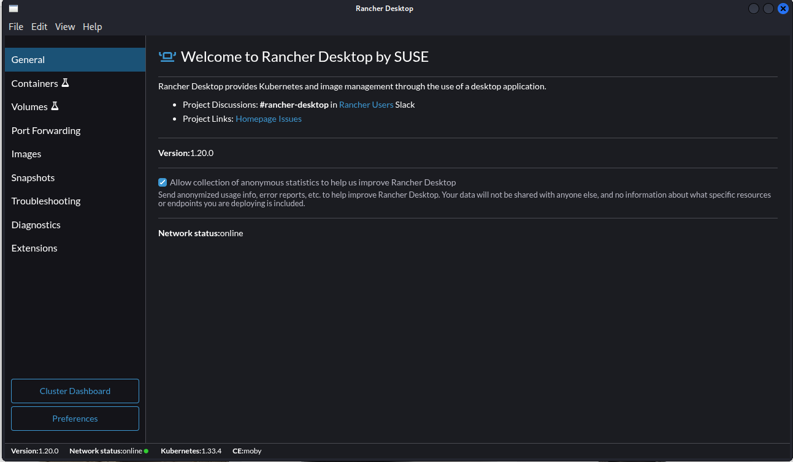
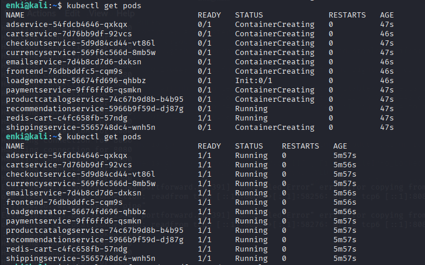
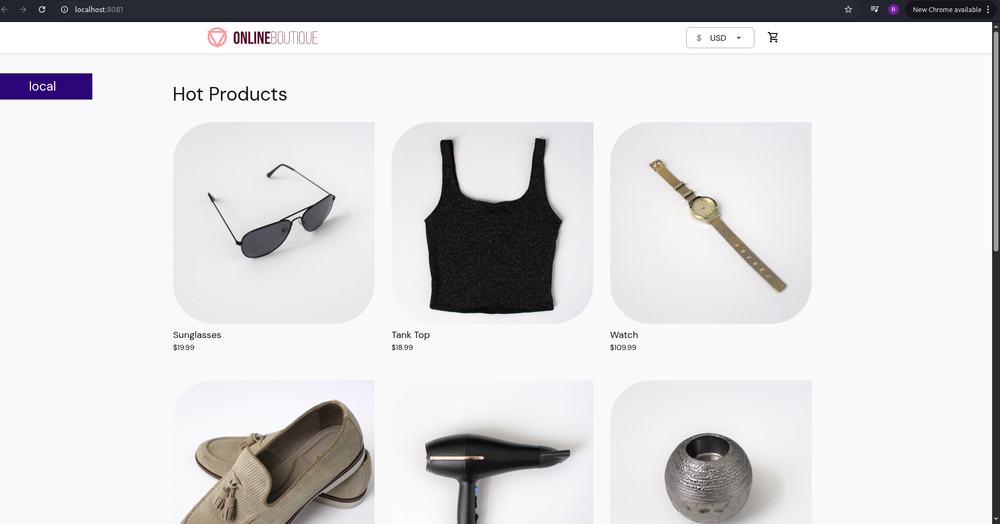

# Projeto Online Boutique com Kubernetes e ArgoCD

Este repositório contém os manifestos e configurações necessários para rodar o **Online Boutique (Microservices Demo)** em um cluster Kubernetes local, utilizando o **Rancher Desktop** e gerenciado pelo **ArgoCD**.

---

## 🚀 Passo a passo do projeto

### 1. Pré-requisitos

* **Linux** (utilizado: Kali Linux)
* **Docker** instalado e funcionando (`docker run hello-world`)
* **Kubectl** instalado (`kubectl version --client`)
* **Rancher Desktop** instalado e Kubernetes habilitado
* **ArgoCD** instalado no cluster Kubernetes

### 2. Subindo o cluster local

* Com o Rancher Desktop instalado, habilita-se o Kubernetes e valida-se:

  ```bash
  kubectl get nodes
  ```

  O nó `rancher-desktop` aparece como `Ready` ✅.


---

### 3. Instalando o ArgoCD

1. Cria-se o namespace e aplica-se o manifest oficial:

   ```bash
   kubectl create namespace argocd
   kubectl apply -n argocd -f https://raw.githubusercontent.com/argoproj/argo-cd/stable/manifests/install.yaml
   ```

2. Aguarda-se os pods ficarem `Running`:

   ```bash
   kubectl get pods -n argocd
   ```

3. Faz-se o port-forward para acessar a interface web:

   ```bash
   kubectl port-forward svc/argocd-server -n argocd 8080:443
   ```

   Acessível em: [https://localhost:8080](https://localhost:8080)

---

### 4. Configuração do ArgoCD

* O login é feito com usuário `admin` e a senha inicial extraída do secret:

  ```bash
  kubectl -n argocd get secret argocd-initial-admin-secret -o jsonpath="{.data.password}" | base64 -d
  ```
* Cria-se a aplicação **Online Boutique** no painel do ArgoCD, apontando para este repositório e a pasta `k8s`.




---

### 5. Deploy da aplicação

* Após a sincronização no ArgoCD, todos os pods do **Online Boutique** são criados com sucesso:

```bash
kubectl get pods
```


* Para acessar o frontend, faz-se:

  ```bash
  kubectl port-forward svc/frontend-external 8081:80
  ```

  Depois, abre-se [http://localhost:8081](http://localhost:8081).

---

### 6. Resultado final

A aplicação roda localmente no Kubernetes, com gerenciamento via ArgoCD.
A tela inicial do Online Boutique aparece conforme esperado, mostrando os **Hot Products**.


---

## ✅ Conclusão

Este projeto mostra como:

* Configurar Docker, Kubectl e Rancher Desktop no Linux
* Subir um cluster Kubernetes local
* Instalar e configurar o ArgoCD
* Fazer deploy do **Online Boutique** usando GitOps

Agora, qualquer alteração feita nos manifests do repositório pode ser sincronizada automaticamente com o cluster via ArgoCD. 🎉
